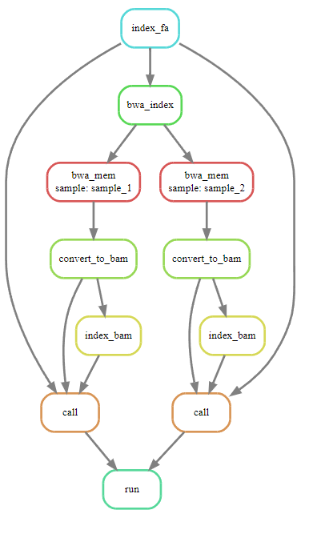

## Esercizio 10

Creare uno `snakefile` che permetta di:

1. Indicizzare un file `ref.fa`
1. Costruire i file di indicizzazione necessari per poter allineare con `bwa mem`
1. Allineare i sample `sample_1` e `sample_2` con `bwa mem`
1. Convertire gli allineamenti da `sam` a `bam`
1. Indicizzare un file `bam`
1. Costruire un VCF con `bcftools` contenente le chiamate di varianti per ogni sample (dopo aver indicizzato `ref` e `bam`)

Infine aggiungere una regola `clean` per cancellare tutti i dati generati e riportare la cartella al suo contenuto orginale

DAG di esempio:

